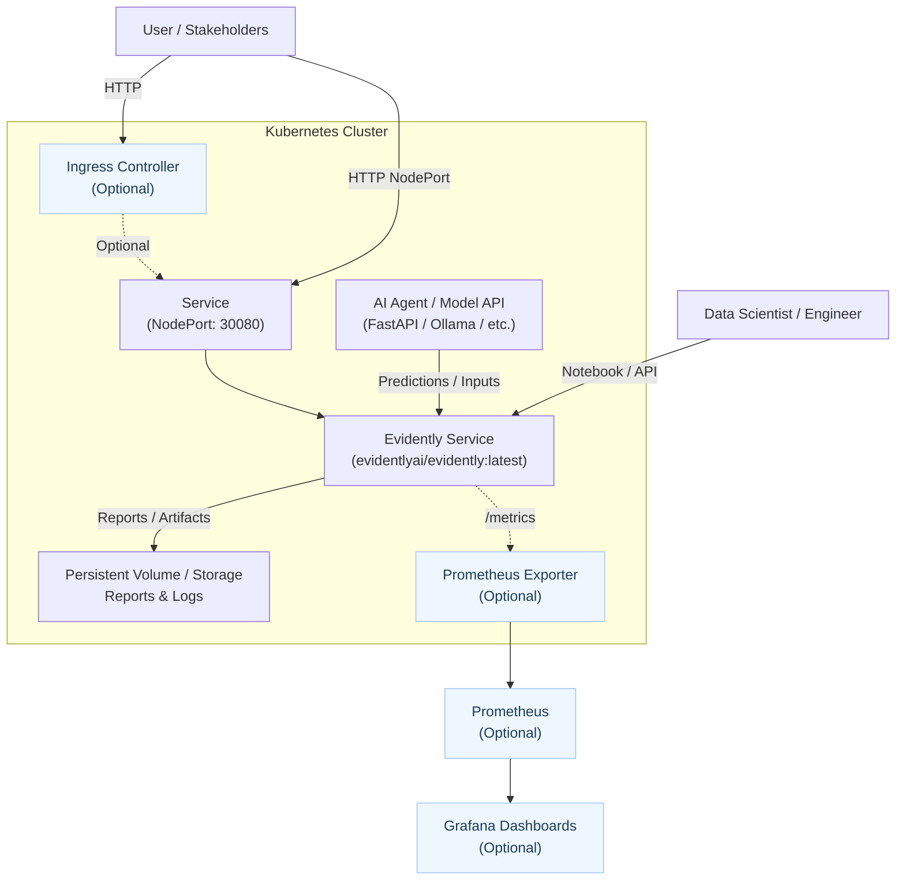

# Evidently AI on Kubernetes — Demo

📊 Run Evidently AI as a service on Kubernetes (Minikube, AKS, EKS, GKE) to monitor data drift, quality, and performance.

This repository provides Kubernetes manifests to run [Evidently AI](https://github.com/evidentlyai/evidently) as a service inside your cluster (EKS, GKE, AKS, Minikube, etc.).
You can connect it to any AI Agent or ML model (RAG, Ollama, FastAPI, etc.) to monitor model performance, detect data drift, and generate reports.

<a id="for-managers"></a>

## For managers: AI governance context
This demo helps create operational evidence for AI governance and monitoring:
- What it is: Evidently focuses on model/data monitoring and reporting (drift, data quality, performance), producing auditable artifacts and dashboards.
- Why it matters: Continuous monitoring supports “measure and manage” functions in governance programs and reduces model risk in production.
- How it maps to frameworks:
  - EU AI Act: Supports risk management, data governance, technical documentation, logging, and post-market monitoring obligations (esp. high-risk systems).
  - NIST AI RMF 1.0: Strongly aligned to Measure and Manage; outputs inform Govern and Map (roles, risk register, system context).
  - ISO/IEC 42001 (AI Management System): Contributes to operational controls, KPIs, and continual improvement evidence for audits.
  - GDPR: Enables accountability via logging and audit trails; pair with data minimization, pseudonymization, and role-based access.
- What it does not replace: Policies, human oversight, DPIAs, or model documentation (e.g., model cards). Use alongside broader Responsible AI controls.

---

## Index
- [For managers: AI governance context](#for-managers)
- [Quickstart](#quickstart)
  - [0. Prerequisites](#0-prerequisites)
  - [1. Clone repo](#1-clone-repo)
  - [2. Deploy on Kubernetes](#2-deploy-on-kubernetes)
  - [3. Verify](#3-verify)
  - [4. Access Evidently (NodePort, default)](#4-access-evidently-nodeport-default)
  - [5. Optional: Access via Ingress](#5-optional-access-via-ingress)
  - [6. Optional: Port-forward (no cluster exposure)](#6-optional-port-forward-no-cluster-exposure)
- [Connecting to your AI Agent](#connect-ai-agent)
- [Architecture](#architecture)
- [AI Governance Considerations](#ai-governance)
- [Cleanup](#cleanup)
- [Next steps](#next-steps)

<a id="quickstart"></a>

## 🚀 Quickstart

### 0. Prerequisites
- A Kubernetes cluster and kubectl configured
- Optional: A namespace to isolate resources
- Optional: An Ingress Controller (e.g., NGINX) if you plan to use Ingress

Create a namespace (optional but recommended):
```bash
kubectl create namespace evidently
```

### 1. Clone repo
```bash
git clone https://github.com/AI-Governance-Lab/k8s-evidently-demo.git
cd k8s-evidently-demo
```

### 2. Deploy on Kubernetes
```bash
kubectl apply -n evidently -f k8s/deployment.yaml
kubectl apply -n evidently -f k8s/service.yaml
```

### 3. Verify
```bash
kubectl get pods -n evidently
kubectl get svc evidently-service -n evidently
```
Wait until the pod is Ready (1/1). If needed:
```bash
kubectl describe pods -l app=evidently -n evidently
kubectl logs deploy/evidently -n evidently
```

### 4. Access Evidently (NodePort, default)
- Get the node IP and open in a browser:
```bash
kubectl get svc evidently-service -n evidently
```
Then open: http://<node-ip>:30080

- Minikube shortcut:
```bash
minikube service evidently-service -n evidently --url
```

### 5. Optional: Access via Ingress
If you have an Ingress Controller and a manifest at k8s/ingress.yaml:
```bash
kubectl apply -n evidently -f k8s/ingress.yaml
kubectl get ingress -n evidently
```
Point your DNS (or hosts file) to the ingress host and open it in a browser.

### 6. Optional: Port-forward (no cluster exposure)
```bash
kubectl -n evidently port-forward deployment/evidently 8000:8000
```
Open: http://localhost:8000

<a id="connect-ai-agent"></a>

## 📡 Connecting to your AI Agent
Any AI agent or ML service can send data to Evidently:
- Log predictions/inputs in JSON/CSV
- Use Evidently’s Python client to generate reports
- Mount a shared volume or push results via API
- Check examples/sample_notebook.ipynb for a minimal workflow

<a id="architecture"></a>

## 🏛️ Architecture


<a id="ai-governance"></a>

## 🛡️ AI Governance Considerations
- Risk management and monitoring
  - EU AI Act: supports post-market monitoring, logging, and technical documentation for high-risk AI. Use Evidently reports as auditable artifacts.
  - NIST AI RMF: aligns with Measure/Manage functions (metrics, monitoring, response). Feed outcomes into Govern/Map (roles, risk register, system context).
  - ISO/IEC 42001: contributes operational controls for KPIs, continuous improvement, and evidence for audits.
- Data governance, privacy, and security
  - Define schemas for inputs/outputs; version datasets used for reports.
  - Apply data minimization and PII redaction/pseudonymization before logging. Restrict access with RBAC/NetworkPolicies.
  - Observe retention/erasure policies (e.g., GDPR). Encrypt data at rest/in transit as required.
- Quality, drift, and performance
  - Track drift, data quality, and performance metrics. Set thresholds and alerts. Investigate outliers and regressions.
- Lineage, reproducibility, and auditability
  - Persist reports and configs; store model/version metadata; timestamp artifacts and keep change logs.
- Operations and incident response
  - Define alert routes and on-call; add runbooks; test rollback/fallback strategies. Integrate with Prometheus/Grafana for continuous visibility.

<a id="cleanup"></a>

## 🧹 Cleanup
```bash
# If applied
kubectl delete -n evidently -f k8s/ingress.yaml || true

kubectl delete -n evidently -f k8s/service.yaml
kubectl delete -n evidently -f k8s/deployment.yaml

# Optional: remove namespace
kubectl delete namespace evidently
```

<a id="next-steps"></a>

## 🛠️ Next steps
- Add Prometheus exporter for continuous metrics
- Create Helm chart
- Build Grafana dashboards

---

📌 Notes  
This repository is maintained as part of my personal learning and PoC development for AI Governance.